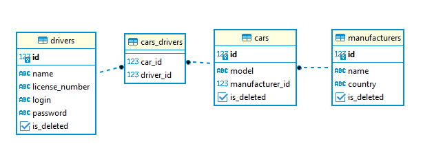

# Taxi-Service

### Project description:

```A simple web-application that supports authentication, registration and other CRUD operations.```

## Features 👀️:

- Registration like a driver
- Authentication like a driver
- Create new driver
- Create new manufacturer
- Create new car
- Display all drivers
- Display all manufacturers
- Display all cars
- Delete driver or manufacturer or car
- Adding driver to car.
- Login and Logout

## 🚀️ Installation 🚀️

1. Type git clone, and then paste the URL you copied earlier.
   - `$ git clone https://github.com/DenysShl/taxi-service.git`
2. Init DB a file `init_db.sql` if MySql and use this dependency for `pom.xml`

````xml
    <dependency>
        <groupId>mysql</groupId>
        <artifactId>mysql-connector-java</artifactId>
        <version>8.0.22</version>
    </dependency>
````

or `init_db_pg.sql` if your use PostgreSql your need use dependency for `pom.xml`

````xml
    <dependency>
        <groupId>org.postgresql</groupId>
        <artifactId>postgresql</artifactId>
        <version>42.3.5</version>
    </dependency>
````

3. If your want data test, there use insert data from file `data_for_test`

### _Structure database_



### _Structure project_


<line>  </line>

## License

With free open source
