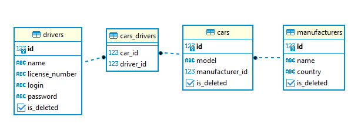
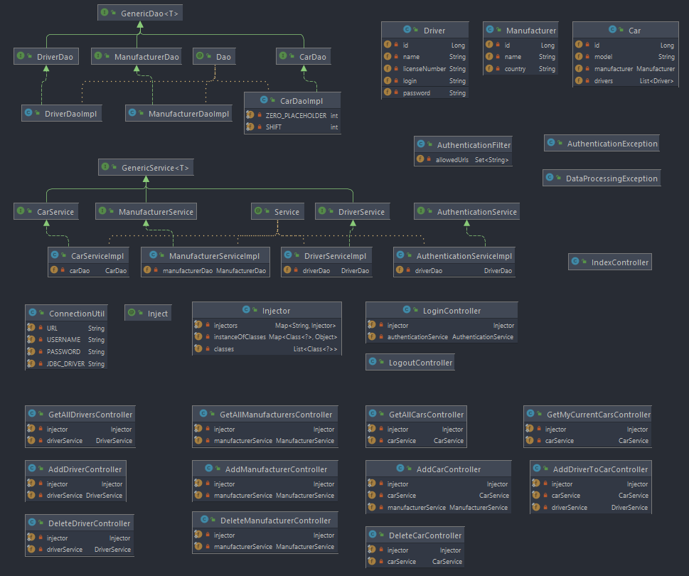

#  Taxi-Service 

### Project description:

```A simple web-application that supports authentication, registration and other CRUD operations.```

## Features 👀️:

- Registration like a driver
- Authentication like a driver
- Create new driver
- Create new manufacturer
- Create new car
- Display all drivers
- Display all manufacturers
- Display all cars
- Delete driver or manufacturer or car
- Adding driver to car.
- Login and Logout

## Realization details
### Project based on 3-layer architecture:
 - Data access layer (DAO)
 - Application layer (services)
 - Presentation layer (controllers)

## Technologies that were used to create the service:
 - Apache Tomcat (to run app locally)
 - MySQL
 - JDBC
 - Servlet
 - JSTL
 - JSP
 - Log4j
 - Maven Checkstyle Plugin

## 🚀️ Installation 🚀️

1. Type git clone, and then paste the URL you copied earlier.
   - `$ git clone https://github.com/DenysShl/taxi-service.git`
2. Init DB a file `init_db.sql` if MySql and use this dependency 
for `pom.xml` -> Init DB using a file `init_db.sql` that's located in resources folder if you use MySQL and dependency for `pom.xml` 
below:
````xml
    <dependency>
        <groupId>mysql</groupId>
        <artifactId>mysql-connector-java</artifactId>
        <version>8.0.22</version>
    </dependency>
````

or `init_db_pg.sql` if your use PostgreSql your need use dependency for `pom.xml` -> or `init_db_pg.sql` that's located in resources folder too if you use PostgreSQL and dependency for `pom.xml` 
below:

````xml
    <dependency>
        <groupId>org.postgresql</groupId>
        <artifactId>postgresql</artifactId>
        <version>42.3.5</version>
    </dependency>
````

3. If your want data test, there use insert data from file `data_for_test`  -> If you want you can use starting set of data for testing of the project. `data_for_test.sql` is located in resources folder.

## Repositories
### 1. [GitHub](https://github.com/DenysShl/taxi-service3.git)
### 2. [Heroku](https://git.heroku.com/taxi-service3.git)

### _ Database structure_



### _Project structure_



### Also, you can just check it out following this link
### [taxi-service3 for heroku](https://taxi-service3.herokuapp.com)

login: `test`
pas: `q123`
